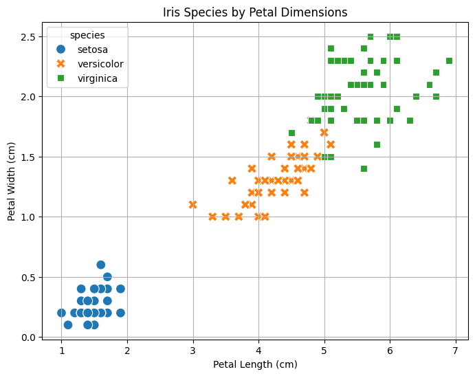

# How to classify Iris using ML systems vs Traditional programming

<!--  -->


Here's a short Colab-friendly demo to compare a simple rule-based approach (using `if/else`) to the conceptual idea of machine learning for the Iris dataset.

---

```python
#@title 1. Setup: Import Libraries and Load Data
# Import necessary libraries
import seaborn as sns
import pandas as pd
import matplotlib.pyplot as plt

# Load the Iris dataset directly from Seaborn
print("Loading Iris dataset...")
iris_df = sns.load_dataset('iris')

# Display the first few rows and some info about the data
print("\nDataset loaded successfully. First 5 rows:")
print(iris_df.head())

print("\nDataset Info:")
iris_df.info()

print("\nSpecies distribution:")
print(iris_df['species'].value_counts())
```

**Explanation:**
*   We import `seaborn` for loading the dataset and easy plotting, `pandas` for data manipulation (Seaborn loads data into a Pandas DataFrame), and `matplotlib.pyplot` for customizing plots.
*   `sns.load_dataset('iris')` fetches the classic Iris dataset.
*   `.head()` shows the first few rows, revealing columns like `sepal_length`, `sepal_width`, `petal_length`, `petal_width`, and the target `species`.
*   `.info()` confirms the data types and non-null counts.
*   `.value_counts()` shows we have 50 samples for each of the 3 species (setosa, versicolor, virginica).

---

```python
#@title 2. Visualize the Data
print("Creating scatter plot (Petal Length vs Petal Width)...")

plt.figure(figsize=(8, 6)) # Set figure size for better readability
sns.scatterplot(data=iris_df, x='petal_length', y='petal_width', hue='species', style='species', s=100) # s=100 makes points bigger
plt.title('Iris Species by Petal Dimensions')
plt.xlabel('Petal Length (cm)')
plt.ylabel('Petal Width (cm)')
plt.grid(True) # Add a grid
plt.show()

print("\nCreating scatter plot (Sepal Length vs Sepal Width)...")
plt.figure(figsize=(8, 6))
sns.scatterplot(data=iris_df, x='sepal_length', y='sepal_width', hue='species', style='species', s=100)
plt.title('Iris Species by Sepal Dimensions')
plt.xlabel('Sepal Length (cm)')
plt.ylabel('Sepal Width (cm)')
plt.grid(True)
plt.show()
```

**Explanation:**
*   Visualization helps us understand the data's structure and how features relate to the species.
*   We create scatter plots using `seaborn.scatterplot`.
*   The first plot shows `petal_length` vs. `petal_width`. Notice how 'setosa' (blue circles) is clearly separated from the other two species based on petal dimensions. 'Versicolor' (orange squares) and 'virginica' (green triangles) are closer but still somewhat distinguishable.
*   The second plot shows `sepal_length` vs. `sepal_width`. Separation is less clear here, especially between versicolor and virginica. This highlights that *petal* dimensions are generally more informative for classifying Iris species.



---

```python
#@title 3. Rule-Based Classification (using if/elif/else)

# Define a function to classify based on simple petal length rules
# NOTE: These rules are simple approximations based on observation and WILL NOT be perfect.
def classify_iris_rules(petal_length):
  """Classifies Iris species based on simple petal length thresholds."""
  if petal_length < 2.5:  # Rule 1: If petal length is very small
    return 'setosa'
  elif petal_length < 4.9: # Rule 2: If petal length is medium
    return 'versicolor'
  else:                    # Rule 3: Otherwise (petal length is large)
    return 'virginica'

# Apply this function to each row's 'petal_length' to get predicted species
print("Applying rules based on Petal Length...")
iris_df['predicted_species_rule'] = iris_df['petal_length'].apply(classify_iris_rules)

# Compare the actual species with our rule-based prediction for the first 10 rows
print("\nComparison (Actual vs. Rule-Based Prediction):")
print(iris_df[['petal_length', 'species', 'predicted_species_rule']].head(10))

# Show some examples where the rules might fail
print("\nExamples where rules might differ:")
# Find rows where the prediction doesn't match the actual species
mismatches = iris_df[iris_df['species'] != iris_df['predicted_species_rule']]
print(mismatches[['petal_length', 'species', 'predicted_species_rule']].head()) # Display first few mismatches

# Calculate simple accuracy of our rules
accuracy = (iris_df['species'] == iris_df['predicted_species_rule']).mean()
print(f"\nAccuracy of simple rule-based approach: {accuracy:.2%}")

```

**Explanation:**
*   We define a function `classify_iris_rules` that takes `petal_length` as input.
*   Inside the function, we use `if/elif/else` statements with hardcoded thresholds (2.5 cm and 4.9 cm). These thresholds were chosen by looking at the visualization – setosa petals are generally shorter than 2.5 cm, and the overlap between versicolor and virginica happens around 4.9-5.0 cm petal length.
*   `.apply(classify_iris_rules)` runs this function on the `petal_length` column for every row, creating a new `predicted_species_rule` column.
*   We compare the actual `species` with our `predicted_species_rule`. You'll see it works well for setosa but makes mistakes where versicolor and virginica overlap.
*   The accuracy calculation shows that while the rules capture some pattern, they are not perfect (~96% in this simple case, but more complex rules could be worse or better). The key is that **we, the humans, decided the rules beforehand based on observation.**

---

**4. How Machine Learning Differs: Learning Rules from Data**

The rule-based approach we just did involved:
1.  Looking at the data (visualization).
2.  **Manually** identifying patterns (e.g., "short petals mean setosa").
3.  **Hardcoding** these patterns into `if/else` rules.

This works for simple problems but quickly breaks down:
*   What if there are many features (10s, 100s)? Visualizing becomes impossible.
*   What if the relationships are complex and non-linear (not simple thresholds)?
*   What if the best rules involve combinations of features (e.g., "IF petal_length > X AND petal_width < Y THEN ...")? Figuring these out manually is extremely difficult.

**Machine Learning (ML) flips this process:**

1.  **Provide Data:** You give the ML algorithm the **features** (like petal length, petal width, etc. - often called `X`) and the **correct labels** (the actual species - often called `y`).
2.  **Choose Algorithm:** You select an appropriate ML algorithm (like a Decision Tree, Logistic Regression, Support Vector Machine, Neural Network, etc.).
3.  **Training:** The algorithm then *automatically analyzes* the relationship between the features (`X`) and the labels (`y`). Its goal is to find the **internal parameters, patterns, or "rules"** that best predict `y` from `X`, based on the examples provided.
4.  **Inference:** Once trained, the model can take *new*, unseen feature data and predict the corresponding label based on the patterns it learned.

**In essence:**
*   **Rule-Based:** Human defines rules -> Apply to data.
*   **Machine Learning:** Provide data + labels -> Algorithm *learns* rules/patterns -> Apply learned model to new data.

ML doesn't require us to explicitly state "IF petal_length < 2.5 THEN setosa". Instead, the algorithm *discovers* boundaries (which might be much more complex than simple thresholds) in the feature space that optimally separate the different species based on the data it was trained on. It **infers the rules from the data**, rather than having them dictated beforehand.